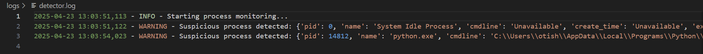

# 🛡️ Keylogger Detector + Dummy Keylogger (Educational Use Only)

A Python-based keylogger detection tool with a harmless dummy keylogger included for testing and educational purposes. Made by Otis Hoymans, a 2nd year student studying Cloud & Cybersecurity @ Thomas More Geel.

## 📌 Features

### Keylogger Detection:
- Detects suspicious processes based on:
  - Process names and command-line arguments
  - Suspicious directories where keyloggers might reside
  - Heuristic analysis using keylogger-related keywords
- Logs alerts to a file and prints them to the terminal for real-time feedback

### Dummy Keylogger:
- A simple dummy keylogger script to simulate keystroke logging
- Can be used to test the detection tool by generating logs of keystrokes

### Logs:
- Suspicious processes are logged to `logs/detector.log`
- Captured keystrokes from the dummy keylogger are logged to `logs/keylog.log`

## 📸 Screenshots

### Dummy Keylogger:


### Keylogger Detection:


## ⚠️ Disclaimer
This project is strictly for educational and testing purposes. DO NOT use the dummy keylogger on any system without proper authorization and understanding of the legal and ethical implications.

## 🧪 How to Run

### 1. Install Dependencies
Ensure you have Python 3.7+ installed. Then install the required dependencies by running:

```
pip install -r requirements.txt
```

### 2. Run the keylogger
```
python ./dummy_keylogger.py
```

### 3. Run the detection script
```
python ./detector.py
```

### 4. Check the logs in the logs folder

## Project Structure
```
/project-root
│
├── detector.py         # The keylogger detector script
├── dummy_keylogger.py  # The dummy keylogger for testing purposes
├── requirements.txt    # Python dependencies file
├── README.md           # This file
├── /img                # Screenshots folder
│   ├── image.png       # Keylogger detection screenshot
│   └── image2.png      # Dummy keylogger screenshot
└── /logs               # Logs folder (created automatically)
    ├── detector.log    # Log for suspicious processes
    └── keylog.log      # Log for captured keystrokes (dummy keylogger)
```